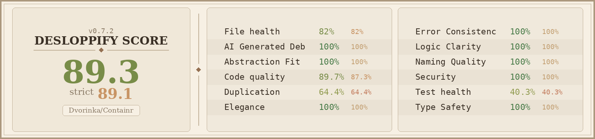

<p align="center">
  
</p>

<h1 align="center">
  Containr - Modern Container Management Platform
</h1>
<p align="center">
  🚧 <strong>Work in Progress</strong> - Not yet fully tested
</p>
<p align="center">
  Deploy, manage, and scale containers with built-in Cloudflare tunnel support.
</p>

<p align="center">
  <a href="#quick-start">Quick Start</a>
  <span>&nbsp;&nbsp;•&nbsp;&nbsp;</span>
  <a href="#features">Features</a>
  <span>&nbsp;&nbsp;•&nbsp;&nbsp;</span>
  <a href="#tech-stack">Tech Stack</a>
  <span>&nbsp;&nbsp;•&nbsp;&nbsp;</span>
  <a href="#documentation">Documentation</a>
  <span>&nbsp;&nbsp;•&nbsp;&nbsp;</span>
  <a href="#contributing">Contributing</a>
</p>

<p align="center">
  
</p>

> **🚀 Inspired by Railway**: This project draws inspiration from [Railway](https://railway.app)'s seamless deployment experience and developer-friendly approach. The goal is to bring that same level of simplicity and power to self-hosted container management.

## Introduction

I built Containr because I was tired of complex container orchestration tools that required weeks of setup and deep expertise. You know how it is – Kubernetes clusters to configure, CI/CD pipelines to maintain, networking nightmares to debug, and that simple app deployment that somehow took three days to get running.

So I decided to build my own solution. Containr is basically the platform I wish I had – one place to deploy, manage, and scale containers without the complexity. It's open-source and self-hosted because I believe your infrastructure should belong to you, not some cloud provider.

It's like if Docker Compose, Traefik, and a modern dashboard had a baby. Built by one person (with AI's help), for anyone who's tired of container management being a mess.

### My Design Inspiration

I've always been a huge fan of **Portainer** – their clean, intuitive approach to container management just makes sense. Everything feels intentional and puts your containers first.

So yeah, Containr borrows heavily from that design philosophy. But I wrote every line of code from scratch – this isn't some fork or copy-paste job. I took that beautiful simplicity and tried to expand it into more of a comprehensive container platform with modern features.

### The AI-Assisted Journey

This project was built with **Windsurf SWE 1.5**.

Look, I'll be honest – I'm not the best DevOps engineer out there. But I really wanted to build something that solves real problems, and I think passion matters more than being perfect. Windsurf helped me figure out the hard stuff, learn new technologies, and actually build something I'm proud of.

As a solo dev, having an AI pair programmer made this whole thing possible. Go backend, React frontend, Docker orchestration – stuff I probably couldn't have tackled alone. It's pretty cool what you can create when humans and AI work together, even when you're still learning.

With Containr, your container deployments are centralized, scalable, and easy to manage, while remaining self-hosted so you maintain full control and privacy – just as it should be.

## Project Status

Containr is production-ready for small to medium deployments with comprehensive features for container management. The platform has been enhanced with enterprise-grade security, monitoring, and reliability features.

**Production Readiness Score: 75/100**

- ✅ Core functionality complete and tested
- ✅ Security hardening implemented
- ✅ Structured logging and error handling
- ✅ Rate limiting and request validation
- ✅ Comprehensive documentation
- ⚠️ Monitoring integration recommended
- ⚠️ Load testing recommended for high-traffic scenarios

See [PRODUCTION_READINESS.md](./PRODUCTION_READINESS.md) for detailed assessment.

## Features

### Core Functionality
- **Container Management**: Deploy, start, stop, and restart containers with ease
- **Service Orchestration**: Manage multi-container applications with Docker Compose integration
- **Automatic SSL**: Built-in Let's Encrypt certificate management with Traefik
- **Cloudflare Tunnel**: Zero-config deployment with automatic public URLs
- **Web Dashboard**: Modern React-based interface for container management
- **Real-time Logs**: View and search container logs in real-time

### Advanced Features
- **Auto-scaling**: Automatic horizontal scaling based on resource metrics
- **Health Monitoring**: Comprehensive health checks and monitoring for all services
- **Resource Metrics**: CPU, memory, and network usage tracking
- **Preview Environments**: Automatic preview deployments for branches
- **Git Integration**: Connect repositories for automatic deployments
- **Environment Variables**: Secure management of application secrets and configuration
- **Database Management**: Built-in PostgreSQL and Redis with automated backups
- **Security Scanning**: Container vulnerability scanning and compliance reporting

### Deployment & Infrastructure
- **Multi-environment Support**: Development, staging, and production configurations
- **Load Balancing**: Intelligent traffic distribution with Traefik
- **Service Discovery**: Automatic service registration and discovery
- **Network Management**: Isolated networks and secure inter-service communication
- **Volume Management**: Persistent storage with automated backups
- **CI/CD Integration**: GitHub Actions and GitLab CI integration

### Security & Compliance
- **Authentication**: JWT-based authentication with OAuth2 support
- **Role-based Access Control**: Granular permissions for users and teams
- **Audit Logging**: Comprehensive audit trails for all actions
- **Data Encryption**: Encrypted storage for sensitive data
- **Security Scanning**: Automated vulnerability assessment
- **Compliance Reporting**: GDPR and SOC2 compliance frameworks

## Tech Stack

### Frontend
- **React + TypeScript** – Modern, reactive UI framework with type safety
- **Vite** – Fast build tool and development server with HMR
- **TailwindCSS** – Utility-first CSS framework for rapid UI development
- **@tanstack/react-query** – Powerful data fetching and state management
- **React Router** – Client-side routing for SPAs
- **@xyflow/react** – Interactive diagrams and visualizations
- **Recharts** – Beautiful charts and data visualization
- **Zustand** – Lightweight state management

### Backend Services
- **Main Backend (Go)** – Core API, container management, and business logic
  - Gin web framework for HTTP routing
  - GORM for database operations
  - JWT authentication and authorization
  - Docker SDK integration
- **Database Layer** – PostgreSQL for production data
- **Cache Layer** – Redis for session management and caching
- **Message Queue** – Background job processing

### Infrastructure & DevOps
- **Docker & Docker Compose** – Containerized deployment
- **Traefik** – Reverse proxy with automatic SSL
- **Cloudflare Tunnel** – Zero-config public exposure
- **PostgreSQL** – Primary database
- **Redis** – Caching and session storage
- **Nginx** – Static file serving

## Quick Start

### Prerequisites
- Docker Engine with Compose v2 (`docker compose`)
- Git

### Installation with Docker (Recommended)

1. **Clone the repository**
   ```bash
   git clone https://github.com/your-username/containr.git
   cd containr
   ```

2. **Configure environment**
   ```bash
   cp .env.example .env
   cp .env.production.example .env.prod
   # Edit .env for local development and .env.prod for production
   ```

3. **Start the full local stack**
   ```bash
   docker compose up -d --build
   ```

4. **Access the application**
   - **Local full stack**: http://localhost:3000 (Frontend), http://localhost:8082 (API)
   - **Self-hosted production**: `./start-unified.sh prod`
   - **Cloudflare profile**: `./start-unified.sh cloudflare`

### Split Production Deployment

```bash
# Frontend -> Vercel
cd app/frontend
npm run remote

# Backend only -> self-hosted Docker Compose
cd ../backend
docker compose up -d --build

# Backend -> Railway
# Configure Railway service root directory: /app/backend
# Configure Railway config file path: /app/backend/railway.toml
railway up
```

Use `.env.prod` in the repository root as the canonical production variable set. Copy the relevant values into Vercel and Railway project environments so the remote frontend and backend talk to each other over `FRONTEND_URL`, `BACKEND_URL`, `VITE_API_URL`, and `VITE_AUTH_URL`.

### Management Commands

```bash
./start-unified.sh dev         # Start local full stack
./start-unified.sh prod        # Start self-hosted production stack from infra/
./start-unified.sh cloudflare  # Start self-hosted production stack with cloudflared
./start-unified.sh stop        # Stop both compose stacks
./start-unified.sh logs        # View local stack logs
./start-unified.sh status      # Check service status
./start-unified.sh config      # Validate compose configuration
./start-unified.sh clean       # Clean up containers and volumes
```

## Development

### Project Structure
```
containr/
├── app/
│   ├── frontend/          # React + Vite frontend (deploy from here to Vercel)
│   └── backend/           # Go API + embedded Better Auth runtime
├── infra/                 # Self-hosted production compose + Traefik/cloudflared
├── docs/                  # API contract and design references
├── scripts/               # Utility scripts
├── .env.prod              # Canonical production env template
└── README.md
```

### Local Development

```bash
# Backend
cd app/backend
go mod download
go run cmd/migrate/main.go up   # optional manual migration run (legacy + goose)
go run cmd/server/main.go

# Frontend
cd ../frontend
npm install
npm run dev
```

## Documentation

Comprehensive documentation is available in the project:

- **[Cloudflare Setup](./CLOUDFLARE_SETUP.md)** – Cloudflare tunnel configuration
- **[Docker Setup](./DOCKER_SETUP.md)** – Docker deployment guide
- **[Autoscaling](./AUTOSCALING.md)** – Auto-scaling configuration
- **[API Documentation](./docs/api/openapi.yaml)** – REST API reference

## Configuration

### Environment Variables

Key configuration options in `.env`:

```bash
# Domain Configuration (optional if using Cloudflare)
DOMAIN=yourdomain.com
ACME_EMAIL=admin@yourdomain.com

# Database Configuration
POSTGRES_DB=containr
POSTGRES_USER=containr_user
POSTGRES_PASSWORD=your_secure_postgres_password
MAX_CONNECTIONS=25
MAX_IDLE_CONNECTIONS=5
CONN_MAX_LIFETIME=5m
CONN_MAX_IDLE_TIME=5m

# Redis Configuration
REDIS_PASSWORD=your_secure_redis_password

# Application Configuration
JWT_SECRET=your_very_secure_jwt_secret_key_here # min 32 chars in production
CONTAINR_AGENT_AUTH_TOKEN=your_agent_shared_secret # required for node-agent auth
# Optional rotating token list (comma-separated)
# CONTAINR_AGENT_AUTH_TOKENS=current_secret,next_secret
CORS_ORIGINS=https://yourdomain.com,https://www.yourdomain.com
COOKIE_SECURE=true

# Traefik Authentication (Basic Auth for dashboard)
TRAEFIK_AUTH=admin:$$apr1$$b8mh8c8v$$KkR8hQZQZQZQZQZQZQZQZ/
# true for local dev dashboard on :8080, set false in production
TRAEFIK_API_INSECURE=true

# Cloudflare Tunnel (alternative to domain)
CLOUDFLARED_TOKEN=your_cloudflare_tunnel_token_here

# Optional: Custom Docker Registry
DOCKER_REGISTRY=your-registry.com
DOCKER_USERNAME=your_username
DOCKER_PASSWORD=your_password

# Optional: External Services
SENTRY_DSN=https://your-sentry-dsn
SLACK_WEBHOOK_URL=https://hooks.slack.com/services/your/webhook/url

# Development/Testing
ENVIRONMENT=development
DEBUG=true
TRUSTED_PROXY_CIDR=172.20.0.0/16
```

## Contributing

Building Containr as a solo developer has been an incredible journey, but it's always better when we build together! Whether you're fixing a typo, adding a feature, or just sharing ideas – your contribution matters.

**Feel free to contribute and enhance it to your liking. Help me make this project successful!**

Every contribution, no matter how small, helps turn this solo dream into a community success story. Whether you're a seasoned developer or just starting out, your perspective and skills can help make Containr better for everyone.

Here's how you can join this adventure:

1. **Fork the repository** and make it your own
2. **Create a feature branch** (`git checkout -b feature/amazing-feature`)
3. **Commit your changes** (`git commit -m 'Add some amazing feature'`)
4. **Push to the branch** (`git push origin feature/amazing-feature`)
5. **Open a Pull Request** – I'll be excited to review it!

### Development Guidelines
- Follow Go coding standards for backend development
- Use TypeScript for frontend development  
- Write tests for new features (helps future you!)
- Update documentation as needed
- Remember: this is a labor of love, so let's keep it fun and welcoming

Don't hesitate to reach out if you're new to contributing – we all started somewhere, and I'm happy to help you get started!

## License

This project is licensed under the MIT License - see the [LICENSE](LICENSE) file for details.

## Community & Support

- **Issues**: Use GitHub Issues for bug reports and feature requests
- **Discussions**: Use GitHub Discussions for questions and community support
- **Documentation**: Check the project files for comprehensive guides

## Acknowledgements

### Inspiration
- **[Portainer](https://www.portainer.io/)** – Container management UI inspiration
- **[Docker Compose](https://docs.docker.com/compose/)** – Service orchestration concepts
- **[Traefik](https://traefik.io/)** – Reverse proxy and load balancing
- **[Cloudflare Tunnel](https://www.cloudflare.com/products/tunnel/)** – Zero-config deployment

### Technology Stack
This project is built with amazing open-source technologies:
- **Frontend**: React, TypeScript, Vite, TailwindCSS
- **Backend**: Go, Gin, GORM, PostgreSQL
- **Infrastructure**: Docker, Traefik, Cloudflare, Redis

## A Personal Note

Thank you for taking the time to look at my project. Containr represents months of learning, building, and dreaming – all in the service of creating something that makes container management a little more accessible and a lot more powerful.

In a world of complex orchestration tools and expensive cloud services, I believe there's beauty in owning your infrastructure. Containr is my attempt to build that bridge between simplicity and power.

Whether you use it, contribute to it, or just find inspiration here – know that you're part of something special. A solo developer's dream, powered by AI assistance, and shared with the open-source community.

---

**Containr** – Built with ❤️ by one human, one AI, and a passion for better container management.
