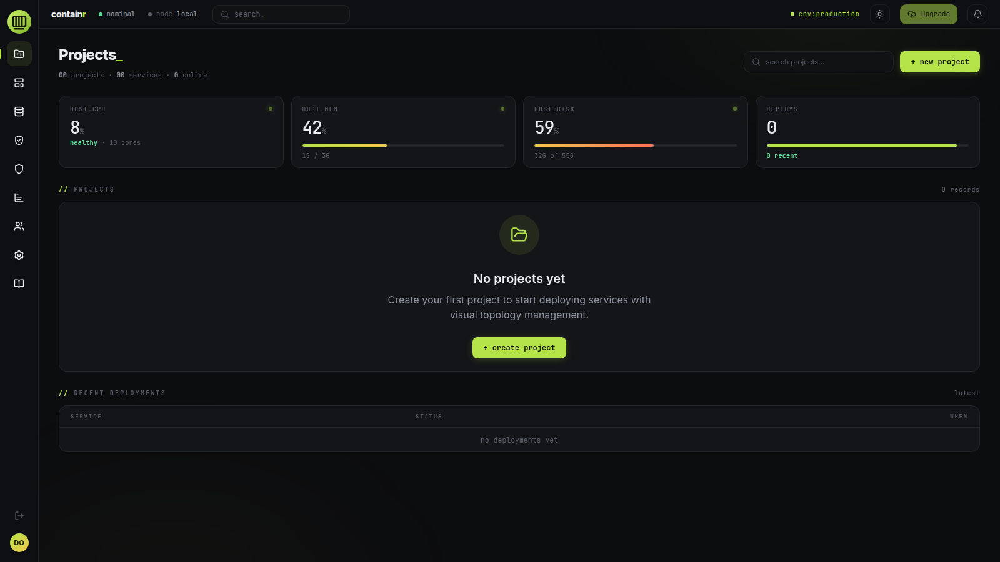
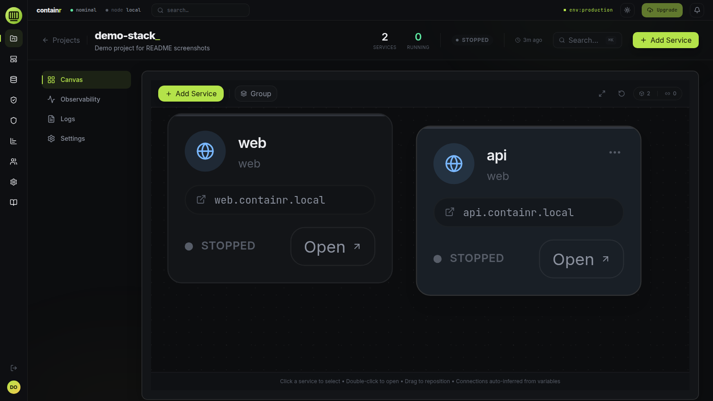
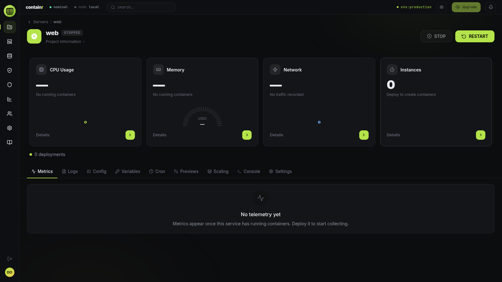
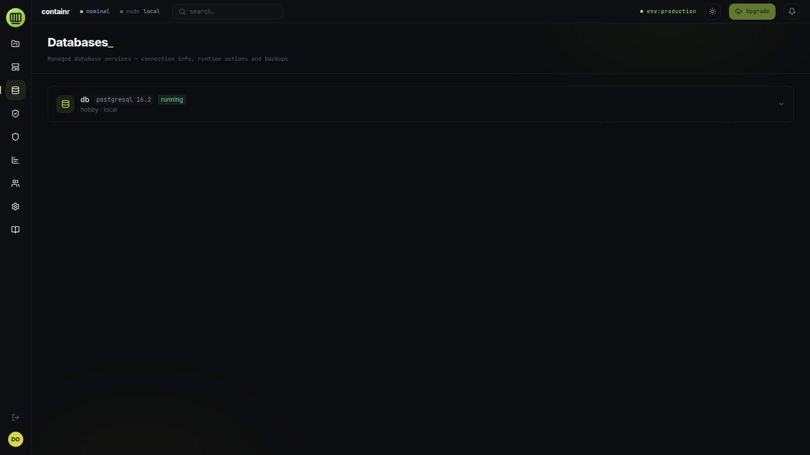

<p align="center">
  
</p>

<h1 align="center">Containr</h1>

<p align="center">
  Self-hosted platform for deploying and managing containerized services.
  Railway-style project canvases on your own hardware.
</p>

<p align="center">
  <a href="#quick-start">Quick Start</a> •
  <a href="#screenshots">Screenshots</a> •
  <a href="#features">Features</a> •
  <a href="docs/guides/">Guides</a> •
  <a href="CONTRIBUTING.md">Contributing</a>
</p>

<p align="center">
  <a href="https://github.com/Dvorinka/Containr/actions/workflows/ci.yml"></a>
  <a href="LICENSE"></a>
</p>

Containr is an open-source control plane for Docker. Create a project, drop
services onto a visual canvas, wire them together with environment variables,
and deploy — no Kubernetes, no cloud bill. Services appear as nodes with
auto-inferred connections; logs, metrics, builds, and rollbacks are one
click away.

## Screenshots

| Projects dashboard | Project canvas |
| --- | --- |
|  |  |

| Service detail | Managed databases |
| --- | --- |
|  |  |

## Features

- **Project canvas** — visual service topology, groups, drag/drop, auto-inferred connections
- **Deployments & builds** — Docker deploys with history, logs, rollback, live build status
- **Git integration** — GitHub, GitLab, Bitbucket, Gitea; webhooks, GitHub App
- **Managed databases** — one-click provisioning with backup/restore
- **Metrics** — per-service Docker stats plus host CPU/memory/disk telemetry
- **Templates, cron, previews** — service catalog, scheduled jobs, preview deploys
- **Auth & security** — Better Auth sessions (email/password self-hosted), audit logs, vuln scans
- **Networking** — Traefik reverse proxy, optional Cloudflare Tunnel

## Quick Start

Requires Docker with the Compose plugin, `openssl`, and `curl`:

```bash
curl -fsSL https://raw.githubusercontent.com/Dvorinka/Containr/main/install.sh | bash
```

Installs into `./containr`, generates secrets, pulls the published `:latest`
images, and starts the stack — UI at `http://localhost:3000`, API at
`http://localhost:8082`. Non-interactive; re-runs never overwrite `.env`.
On first visit you create the owner account (email/password); registration
then closes automatically. The owner can reopen it and configure a Cloudflare
Tunnel token under **Settings → Platform** — in-app values override env vars.

Override with env vars:

```bash
curl -fsSL https://raw.githubusercontent.com/Dvorinka/Containr/main/install.sh | \
  HTTP_PORT=8080 CONTAINR_DIR=/opt/containr bash
```

`CONTAINR_VERSION` pins a release tag, `CONTAINR_REF` selects the git ref for
downloaded files, `CONTAINR_BUILD=1` builds from source. From a git checkout,
`./install.sh` installs in place; plain `docker compose up -d` pulls the same
images (`--build` to compile locally).

Local development and self-hosted deployment (Traefik + Cloudflare Tunnel):
see [docs/guides/](docs/guides/) and `infra/docker-compose.yml`.

## Architecture

```
app/frontend/   React 19 + Vite + TypeScript + Tailwind + React Flow
app/backend/    Go API (Gin) · PostgreSQL · Dragonfly · Docker SDK · Better Auth sidecar
infra/          Self-hosted compose: Traefik + Cloudflare Tunnel
docs/           Guides, OpenAPI spec, design documents
```

All configuration is via environment variables — see `.env.example`. Never
commit `.env` or `.env.prod`; if a secret was ever committed, rotate it.

## Documentation

- [docs/guides/](docs/guides/) — setup, deployment, Cloudflare, autoscaling
- [docs/api/openapi.yaml](docs/api/openapi.yaml) — API contract
- [docs/developers/onboarding.md](docs/developers/onboarding.md) — contributor onboarding
- `make help` — common tasks

---

[Contributing](CONTRIBUTING.md) · [Security](SECURITY.md) · [MIT License](LICENSE) © 2026 Tomas Dvorak
